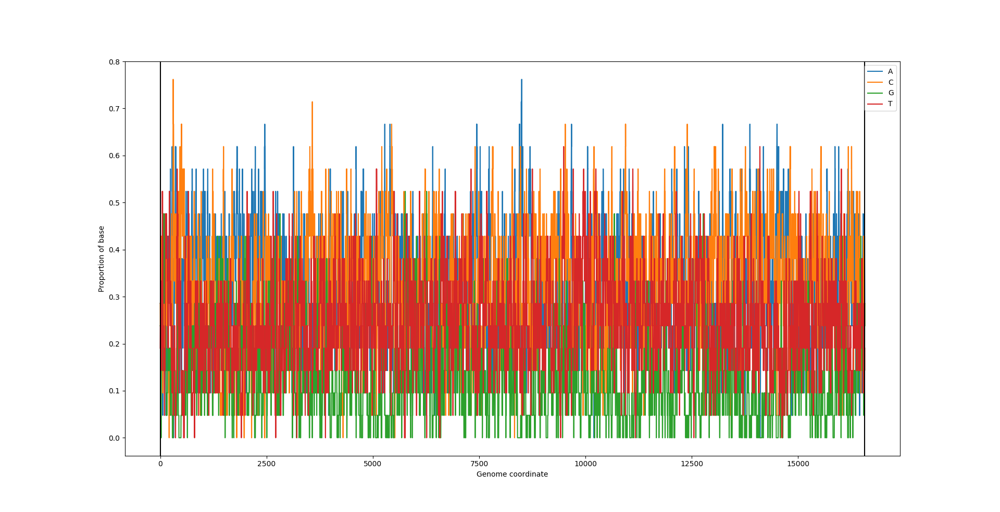
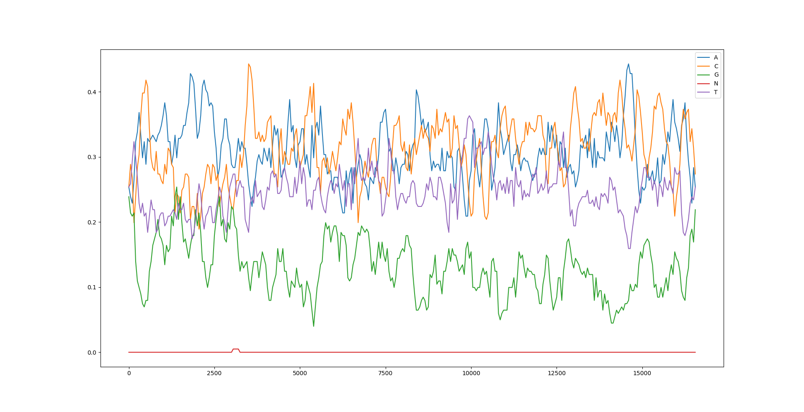
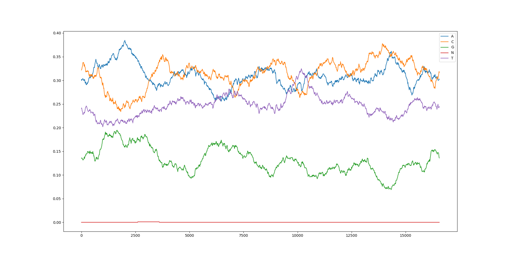
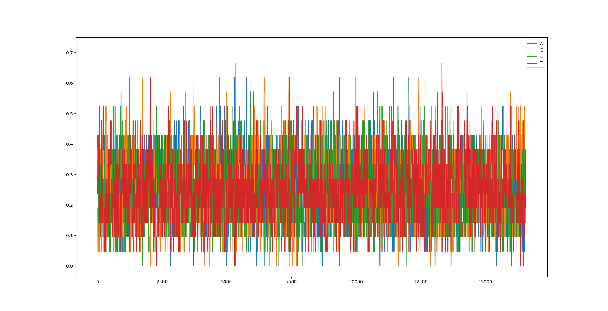
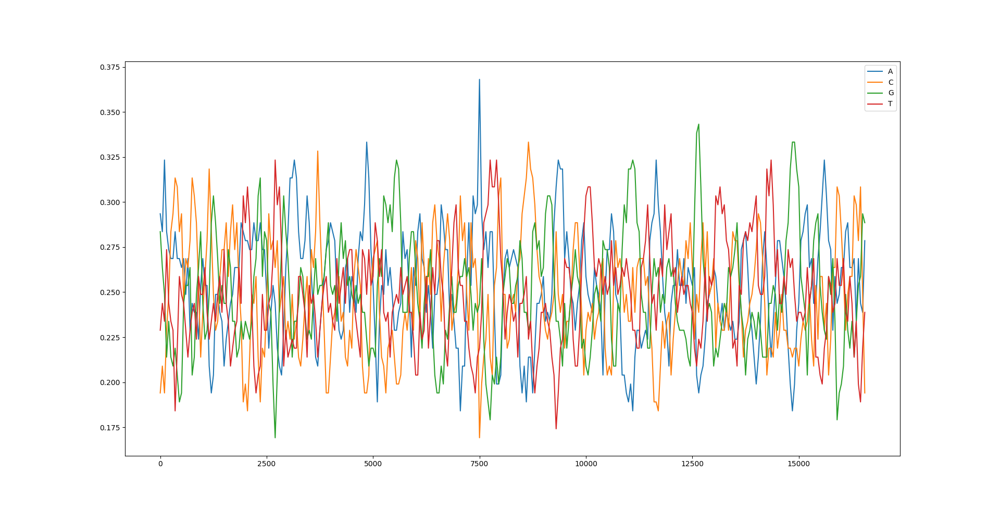
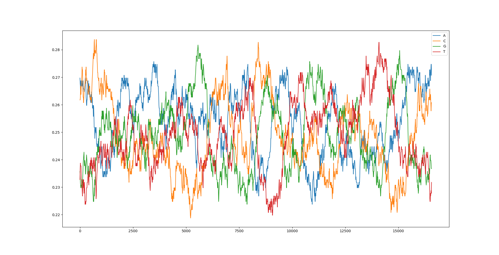

# Mitochondrial genome graphs

The genome is essentially a long list of bases. The x-axis represents a position in the genome.

The y-axis is the proportion of a windowed section (size specified by user) of the genome that is centred around the position represented on the x-axis.

## Comparing different graphs
Each graph is created from 1 of 2 sets of data. There is the actual genome, which is a real mitochondrial genome that has been sequenced by the Wellcome Centre for Mitochondrial Research, and then there is the randomly genereated genome I created in order to compare to the actual genome to see if there would be much difference. In the random genome, each point has an equal chance of being each base, although this isn't actually the case with the real genome.

Each graph also differs in terms of interval (the distance between each sample) and window size.

Actual genome, window: 10, interval: 1

Actual genome, window: 100, interval: 50

Actual genome, window: 500, interval: 10

Random genome, window: 10, interval: 1

Random genome, window: 100, interval: 50

Random genome, window: 500, interval: 10

When looking at the graphs that have a small window size, it is hard to understand the information properly because the lines fluctuate so much between each index position, and there are so many indexes represented in a relativley small space. So it looks very cramped and is hard to take in, which makes it impossible to tell the difference between the randomly generated and actual genomes.

However when looking at larger window sizes, you can see more interesting patterns, and the . The randomly generated genome fluctuates a lot more than the actual genome, similarly to when looking at smaller window sizes, and in the actual genome some bases are more common than others on average, which is not true for the comlpetely random genome.

With interval size, having a smaller inteval means that you won't miss any of the interesting data. However with larger window sizes this doesn't matter, but it can make the line seem smoother by having larger intervals.
