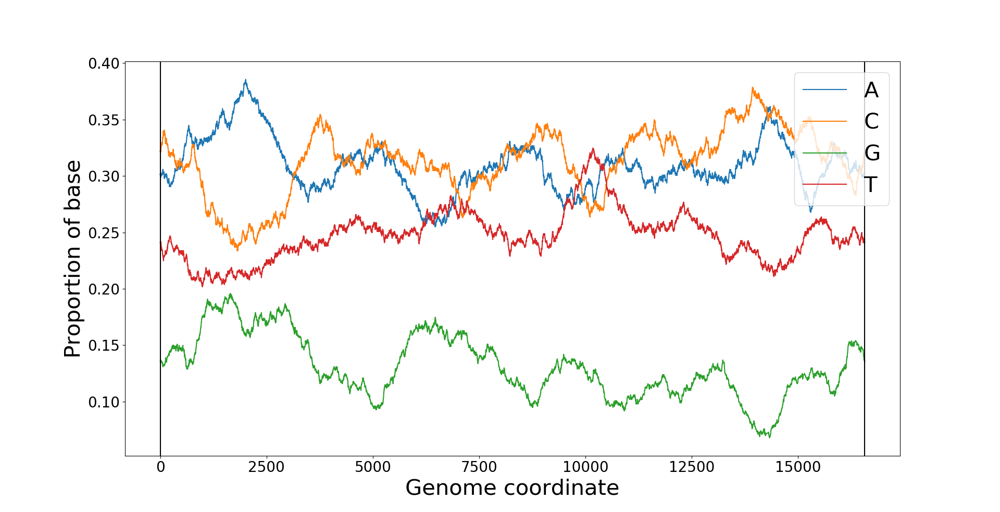
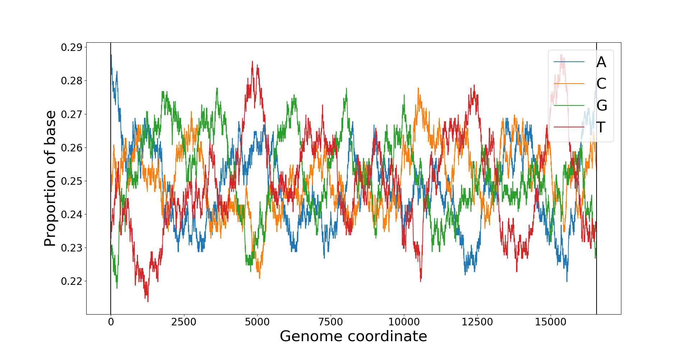

# How nucleobases vary along the mitochondrial genome
Genetic material is made up of 4 different nucleobases called [Adenine](https://en.wikipedia.org/wiki/Adenine), [Cytosine](https://en.wikipedia.org/wiki/Cytosine), [Guanine](https://en.wikipedia.org/wiki/Guanine), and [Thymine](https://en.wikipedia.org/wiki/Thymine). These plots show how the proportion of each base varies along the length of the genome.

## Comparing different plots
Each plot is created from 1 of 2 sets of data. There is the actual genome, which is a real mitochondrial genome that has been sequenced by the Wellcome Centre for Mitochondrial Research, and then there is the randomly genereated genome I created in order to compare to the actual genome to see if there would be much difference. In the random genome, each point has an equal chance of being each base, although this isn't actually the case with the real genome.

These images have a window size of 500, meaning that each point is the average from that point and 500 points either side of it. The reason I used a window size of 500 is because when you use a smaller window size the lines fluctuate so much it is hard to interpret the data.

Actual genome:

Random genome:

<!--When looking at the plots that have a small window size, it is hard to understand the information properly because the lines fluctuate so much between each index position, and there are so many indexes represented in a relativley small space. So it looks very cramped and is hard to take in, which makes it impossible to tell the difference between the randomly generated and actual genomes.
-->
<!--However when looking at larger window sizes, you can see more interesting patterns, and the . The randomly generated genome fluctuates a lot more than the actual genome, similarly to when looking at smaller window sizes, and in the actual genome some bases are more common than others on average, which is not true for the comlpetely random genome.
-->
You can find the [images](../images) and [code](../code) using these links.
