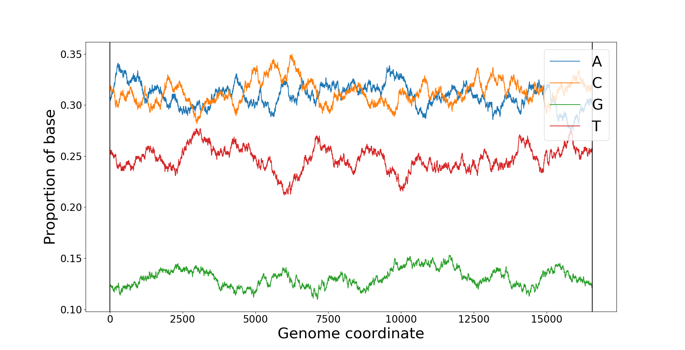
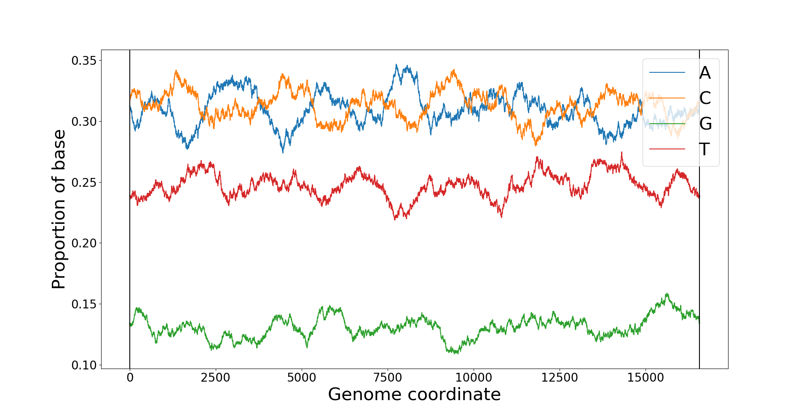
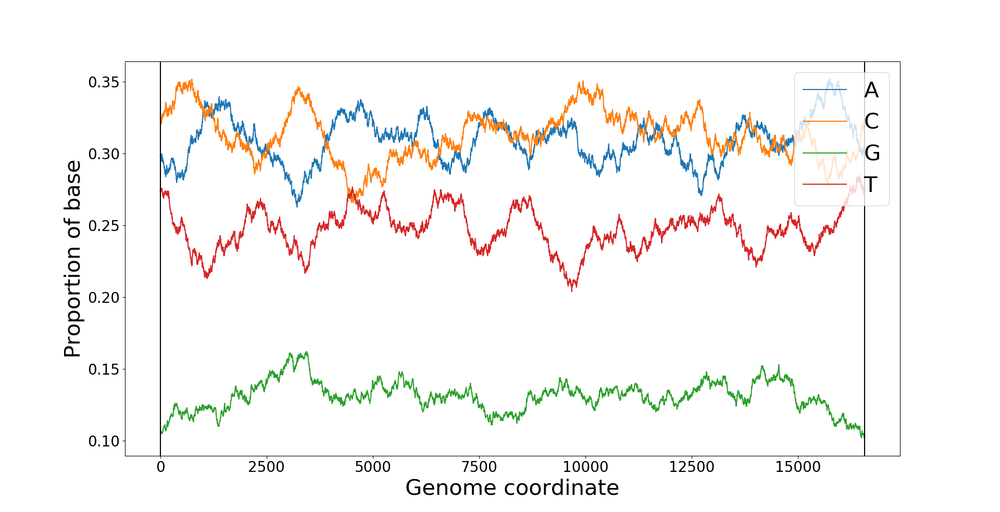

# How nucleobases vary along the mitochondrial genome
Genetic material is made up of 4 different nucleobases called [Adenine](https://en.wikipedia.org/wiki/Adenine), [Cytosine](https://en.wikipedia.org/wiki/Cytosine), [Guanine](https://en.wikipedia.org/wiki/Guanine), and [Thymine](https://en.wikipedia.org/wiki/Thymine). These plots show how the proportion of each base varies along the length of the genome.

## Comparing different plots
Each plot is created from 1 of 2 sets of data. There is the actual genome, which is a real mitochondrial genome that has been sequenced by the [Wellcome Centre](https://www.newcastle-mitochondria.com/) for Mitochondrial Research, and then there are 3 randomly genereated genomes I created in order to compare to the actual genome to see if there would be much difference. In the random genomes, each point has the same chance of being each base as in the actual genome to help make it more a better comparison.

These images have a window size of 500, meaning that each point is the average from that point and 500 points either side of it. The reason I used a window size of 500 is because when you use a smaller window size the lines fluctuate so much it is hard to interpret the data.

Actual genome:

Random genomes:

Although the random and actual genomes are quite similar they are distinguishable. The fluctuations in the proportions for the actual genome are larger and less frequent, whereas the fluctuations for the random genomes are smaller and more frequent, leading to the range of values in the random genomes being smaller.

You can find the [images](../images/base_plots) and [code](../code/nucleobase_plots) using these links.
