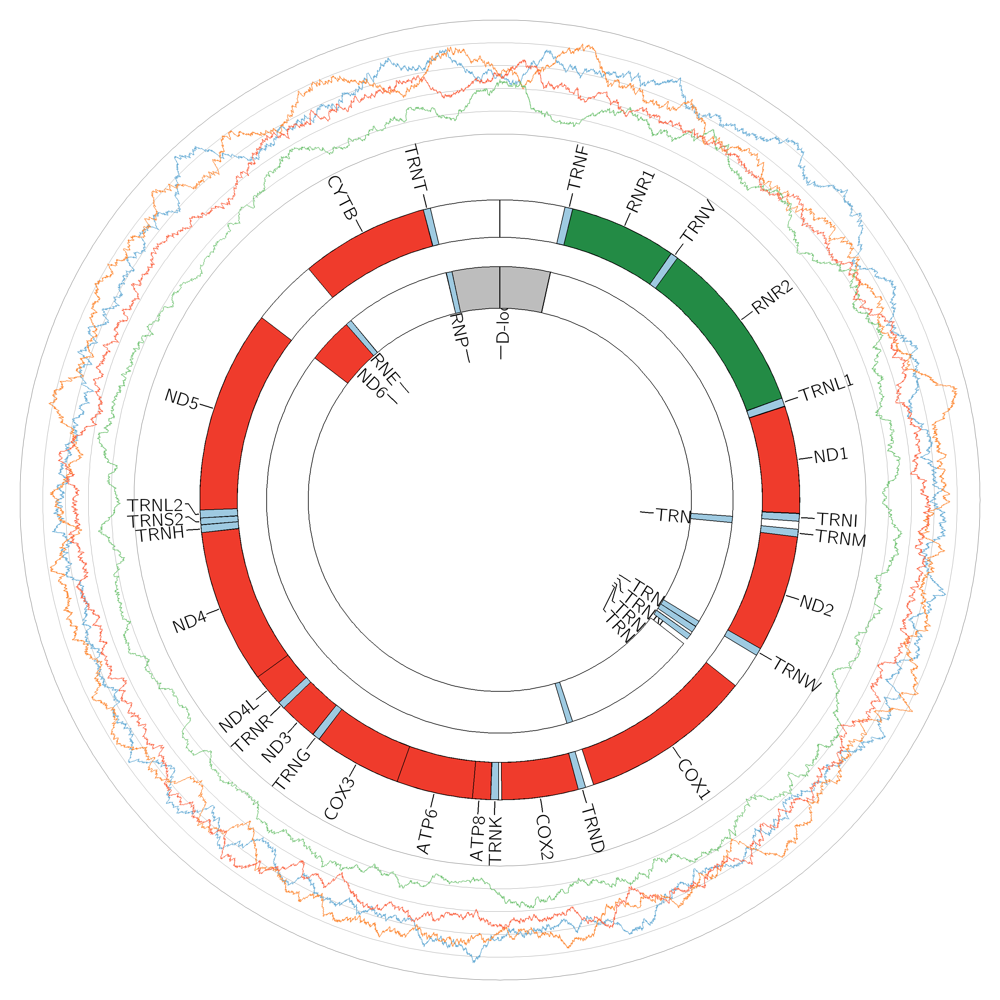
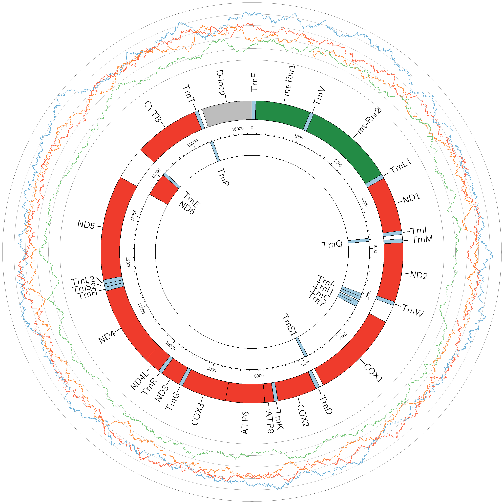
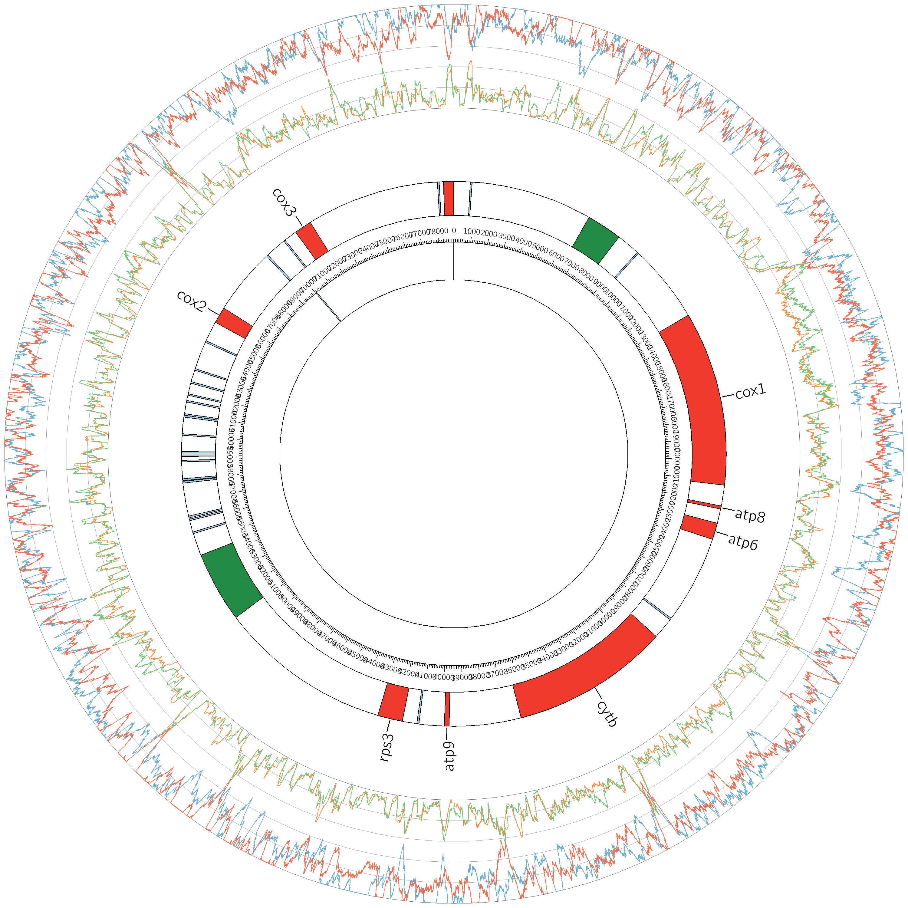

# mtDNA images
This post shows the diagrams that I have created using circos.

In order to create the diagrams you have to pass some parameters to a program I wrote. There are several parameters that affect the features present and the layout of the diagram, however all of the data is accessed using just the accession number of the genome you want. This means that once you have created a style of diagram you like, it is easy to create images for lots of different species.

There are 3 different species I have used here: human([NC_012920.1](https://www.ncbi.nlm.nih.gov/nuccore/251831106)), mouse([NC_005089.1](https://www.ncbi.nlm.nih.gov/nuccore/NC_005089.1)), and yeast([NC_027264.1](https://www.ncbi.nlm.nih.gov/nuccore/836643572)).

The images are in png format, however you can also get [svg images](../images/circos) if you want a vector graphics image, (the quality won't reduce if you zoom in).

## Human:
[svg image](../images/circos/NC_012920.1.svg)

## Mouse:
[svg image](../images/circos/NC_005089.1.svg)

## Yeast:
[svg image](../images/circos/NC_027264.1.svg)

In the diagrams the inner circle section is the - strand, and the outer circle section is the + strand.

The different colours represent different genes, where genes that code for proteins are red, rRNAs are green, tRNAs are blue, the D-loop is grey, and the rest of the genome is white. All of the interesting genomic sections are also labelled.

Around the edge of the chromosome are [nucleobase proportion plots](mitochondrial_genome_plots.md) which use a window size of 100.

## Conclusion
 + Circos is well suited to creating images programmatically. For example, in each of these images I used exactly the same program, I just changed the accession number, and hence the dataset that was used.
 + The images created look nice aesthetically.
 + Although Circos was created to draw DNA it wasn't actually created to draw circular DNA, and is mostly designed around having multiple chromosomes. So it isn't as well suited to that as you would expect.
 + Circos is still not optimised or very refined and lacks some features that you would expect (e.g. a built-in way to draw multiple strands, outward facing labels)
 + These images also show some interesting differences between species:
   + Humans and mice have very similar mtDNA
   + Yeast have no D-loop and have much larger mtDNA, although the amount that is coding for genes is similar to that in humans and mice
   + The - strand contains mauch less genomic features than the + strand in all of these species

All of the [code](../code) and [images](../images/circos) are available for use.
